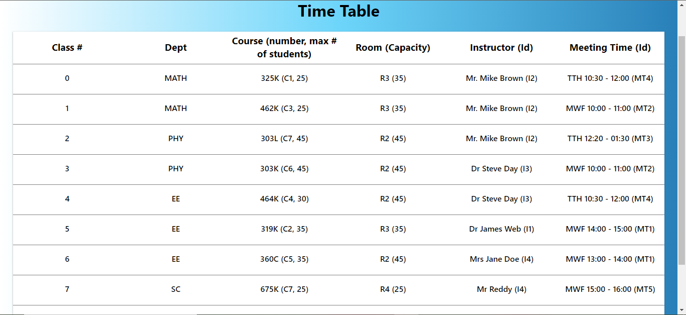

# ken42-frontend-react-app
This is a Time Table generator app for school institutes where Time Table can be generated with some default parameters.

# How to setup and use:

1. Clone the repository
2. Do `yarn`
3. Run the application by `yarn dev`
4. Should clone the server repo also for manual data entry `https://github.com/HanumaraddiBV/ken42-frontend-react-app.git`
5. Make change in data input and  host link for getting personal schedule data

# Tech Stacks used:
1. NodeJs
2. Mongoose
3. ExpressJs
4. MongoDB
5. ReactJs